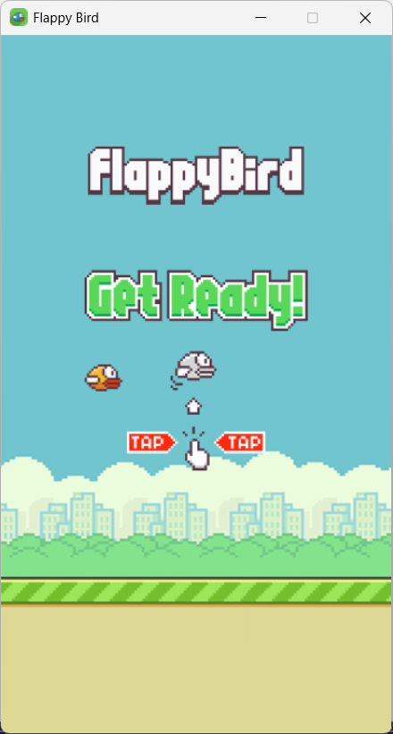
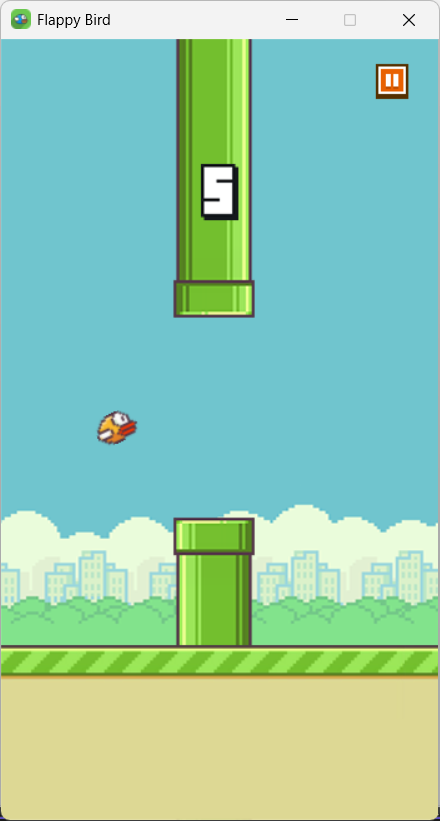

# Yet another Flappy Bird Game

<h3> 🌟 Soar Beyond the Horizon - A Flight to Triumph and Glory 🌟 </h3>

Guide your fearless little bird through an endless sky, where the wind whispers secrets of the heavens and every flap is a step closer to destiny. Dodge towering obstacles, defy gravity, and embrace the thrill of the unknown.

With each graceful ascent, the stars shimmer in quiet applause—will you reach the fabled land of eternal bliss, or will the winds of fate pull you back? The sky is vast, the journey perilous, but the dream of flight lives on.

Flap. Soar. Conquer.

## Screenshots

<div style="display: flex; gap: 20px;">
  <a href="./Screenshots/img1.png">
    
  </a>
  <a href="./Screenshots/img2.png">
    
  </a>
</div>


## Features

- Classic Flappy Bird gameplay mechanics
- Two visual themes (light and dark)
- Sound effects with toggle option
- Pause functionality
- Score tracking with personal best
- Smooth physics-based bird movement
- Randomly generated pipe obstacles


## Requirements

- C++ compiler with C++11 support
- SDL2 library
- SDL2_image for texture loading
- SDL2_mixer for audio
- SDL2_ttf for text rendering

## Installation

Go to our [Latest Release](https://github.com/phamkhoi06/FlappyBirdGame/releases/latest) page and download your preferred variant.
After downloading, extract the contents and run the executable file to start playing.

## Building

1. Clone the repository:
```
git clone https://github.com/phamkhoi06/FlappyBirdGame.git
cd FlappyBirdGame
```

2. Make sure you have all the required SDL2 libraries installed
3. Open solution file by Visual Studio 2017 or higher and compile the source code using the integrated MSBuild build system.
4. Run the game:
```
./flappy-bird.exe
```


## How to Play

- Press **Space** or **Up Arrow** to make the bird flap
- Press **Escape** to pause the game
- Click the **Sound** icon to toggle sound on/off
- Switch between light and dark themes using the arrows in the pause menu
- Click the **Replay** button to restart after a game over


## Game Architecture

### Class Overview

- **BaseTexture**: Foundational class for handling textures and rendering operations
- **Bird**: Manages bird physics, rendering, and collision detection
- **Pipe**: Controls pipe generation, movement, and rendering
- **Land**: Handles the scrolling ground element
- **Game**: Orchestrates game elements and manages the game state
- **Sound**: Handles audio playback for game events


### Game Workflow

The game follows a typical game loop structure:

1. **Initialization**: All game elements are loaded and initialized
2. **Main Game Loop**: Runs continuously until the user quits
    - Process user input (flap, pause, etc.)
    - Update game state (bird position, pipe positions)
    - Check for collisions
    - Render all game elements
    - Control frame rate
3. **Game Over**: When collision occurs, displays score and best score
4. **Reset**: When replay is requested, game state is reset for a new game

### Class Interactions

#### Game Flow and State Management

1. **Main Loop Control**: The `main.cpp` contains the primary game loop that manages frame timing and delegates control to the game instance
2. **State Flags**: The game uses state flags like `isMenu`, `isPause`, `isDark`, and `isSound` to control game behavior

#### Input Handling and Game Events

1. **User Input**: The `game` class processes SDL events and translates them into game actions (PLAY, PAUSE, QUIT)
2. **Event Response**: Based on input type, different actions are triggered (bird flapping, game pausing, theme switching)

#### Bird and Obstacle Mechanics

1. **Bird Physics**: The `Bird` class implements a physics model with gravity and upward force when flapping
2. **Pipe Generation**: The `pipe` class creates randomly positioned pipes and manages their movement
3. **Collision Detection**: Collision between bird and obstacles is checked in the `Bird::update` method, where it examines the position relative to pipes

#### Rendering System

1. **Render Chain**: Each game cycle renders elements in layers - background, pipes, land, bird, UI elements
2. **Texture Management**: The `BaseTexture` class handles loading and rendering of all game assets
3. **Score Display**: Score rendering uses different methods for small and large displays depending on game state

#### Score and Game Progress

1. **Score Increment**: Score increases when the bird successfully passes a pipe
2. **Best Score Management**: The game tracks and persists the best score between sessions
3. **Game Restart**: The `game::Restart` method resets all game elements to their initial state

## Acknowledgements

- **Game Concept**: Inspired by the original Flappy Bird game by Nguyen Thanh Dong.
- **Graphics**: https://github.com/samuelcust/flappy-bird-assets.
- **Audio**: https://1144ghost.itch.io/cozy-winter-music
- **Font**: 
- **Assistance**: ChatGPT-4o and Claude 3.7 sonnet

## License
This project is open-source and available under the MIT License.
